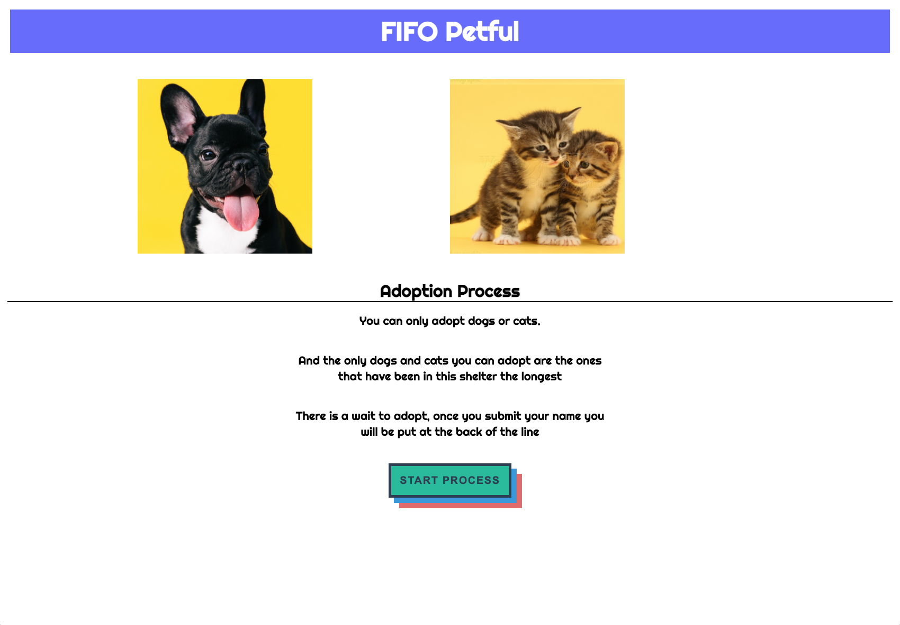
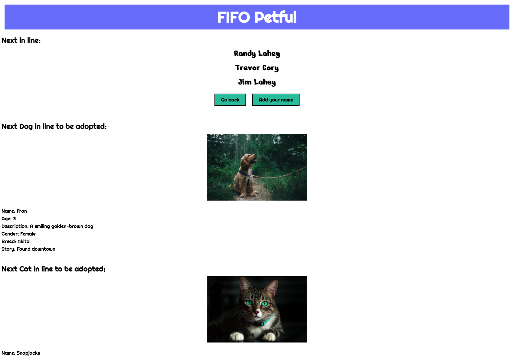

# Petful Client

<h1>The Pet Adoption App!</h1>

<a href="https://petful-client-git-master.donotle98.vercel.app/">Link to Live App!!!</a> 
<a href="https://github.com/donotle98/Petful-Server">Link to Server Code!!!</a> 
The client uses React.js components

<ul>
<li>React Router</li>
<li>Context</li>
<li>Service files</li>
</ul>

This app implements a queue to adopt either a cat or a dog.

The user must first submit their name to the end of the queue, then a timer will start in which pets will start to get adopted at random and names will appear at the end of the queue.

Once the user's name is at the front of the queue, an adopt button will appear below one of the pets, to which the user can press to adopt

Their name will disappear and the animal they chose along with them

<h1>Landing Page</h1>

<h1>Adoption Page</h1>

